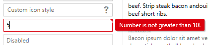

A few months ago [Jeremy Koritzinsky](https://github.com/jkoritzinsky) added initial support for
data validation in Avalonia. Data validation is used by controls such as `TextBox` to display an
error depending on certain constraints on the entered data. For example here is how
[MahApps.Metro](http://mahapps.com/) displays a validation error on a text box:



The goals for Avalonia's data validation are:

- It should be pay-to-play, in that it shouldn't add any overhead to a control that doesn't need
validation
- Data validation was separate from basic "can't be converted" errors, in that if you typed a
string into a `TextBox` that's bound to an integer and that string couldn't be converted to an
`int` then the `TextBox` should show a validation error. This was difficult because type conversions
came before data validation in the binding pipeline.
- Data validation should be enabled by default on properties that support data validation. In WPF
you need to set a property on the binding to enable data validation; in Avalonia, if you bind to
`TextBox.Text` then data validation should be enabled by default, allowing users to fall into the
"pit of success".
- It should be an "MVVM-first" feature. We *expect* people to use MVVM with Avalonia so lets build
data validation with that in mind. That means no `<Binding.Validation>` at the view level, at least
not at first: validation is usually something that should be testable and the view is no place for
that.
- Support the common validation methods: `throw`, `IDataErrorInfo`, `INotifyDataErrorInfo`,
`System.ComponentModel.DataAnnotations` and make the system pluggable.

Many of these were already addressed by Jeremy but some weren't and they weren't easy to fix: data
validation needed to go deeper into the binding system to get everything we wanted. So how does the
new system work?

# How it will look to a control implementer

Data validation will be enabled per-property. In addition, for the moment data validation will only
be available on direct properties. To enable data validation on a property, set the
`EnableDataValidation` flag on property registration:

```csharp
public static readonly DirectProperty<TextBox, string> TextProperty =
    AvaloniaProperty.RegisterDirect<TextBox, string>(
        nameof(Text),
        o => o.Text,
        (o, v) => o.Text = v,
        enableDataValidation: true);

private string _text;

public string Text
{
    get { return _text; }
    set { SetAndRaise(TextProperty, ref _text, value); }
}
```

Once data validation is enabled on a property, any binding to that property will have data
validation enabled, however nothing is done with the validation information by default: as mentioned
before, it is "pay to play" so nothing gets stored unless the control decides to. Instead, the
framework calls the `UpdateDataValidation` method each time a validated binding value is received.
In the example below, we use that information to set the `:error` pseudoclass on the control
depending on the validation state:

```csharp

protected override void UpdateDataValidation(AvaloniaProperty property, BindingNotification status)
{
    // Set the ":error" pseudoclass if the error status is anything but "none".
    if (property == TextProperty)
    {
        ((IPseudoClasses)Classes).Set(":error", status.ErrorType != BindingErrorType.None);
    }
}
```

The `BindingNotification` object received by this method has several properties:

- `ErrorType` is one of 3 values:
  - `None` means no error: the value is valid
  - `Error` means that there was an error in binding, such as the target property could not be
    found, the value could not be converted to the type of the target property, etc.
  - `DataValidationError` means that the target signalled that the value is invalid by throwing
    an exception, or signalling an error through `INotifyDataErrorInfo` etc.
- `Error` is an `Exception` that describes what has happened in the case of an `Error` or
  `DataValidationError`. If more than one error was detected then it will be an `AggregateException`.
- `HasValue` indicates whether there is a `Value`
- `Value` holds the value to push to the property. This may be present even when there is an error -
  in the case the that binding has a `FallbackValue` for example.
